# Sentiment Analysis of Trump's Tweets before election

2020 US presidential election is one of the impactful events in the world. And whether the current president, Donald Trump, will win the election and still serve as US president is hard to predict. In this case it is important to know his attitude toward the 2020 election. I want to do some sentiment analysis on Donald Trump’s tweets during 2016 and 2020 election and see if there’s any changes.

## Description of dataset:

For this project, I will use Donald Trump’s tweets in the year of 2020 and 2016 before election. I will only use two properties: content of the tweets for data mining and date for filter. I will probably use Twitter API to get more data if I need some other properties (e.g. who will be retweeted by Trump).

https://www.kaggle.com/austinreese/trump-tweets

This dataset has 20 versions till now. The latest version contains tweets from 7/18/2020 to 10/8/2020. I cannot download the previous version now so I cannot get the data prior to 7/18 in 2020.
In the previous version it use a different format which contains all the trump's tweets from 2019. So I can get the data in 2016. It seems Kaggle doesn't provide it anymore (1 month before it can be downloaded) but you can get it in the "source_data" folder.


# Data Exploration

## Some Pre-work

First load in the package we will use

```r
library(knitr)
library(tidyr)
library(dplyr)
library(readr)
library(ggplot2)
library(tibble)
library(stringr)
library(gridExtra)
library(scales)
library(lubridate)
library(ggrepel)
library(reshape2)
library(kableExtra)
library(tm)
library(wordcloud)
library(wordcloud2)
library(tidytext)
library(textdata)
library(broom)
library(topicmodels)
library(bit64)
```

Then load the data.
The previous version which contains 2016 tweets is ttweets1.csv.
The latter version is ttweets2.csv.

```r
tweets16 <- timetk::tk_tbl(data.table::fread("ttweets1.csv", encoding= "UTF-8"))
tweets20 <- timetk::tk_tbl(data.table::fread("ttweets2.csv", encoding= "UTF-8"))
```

Then we parse the time in the data because we want to use Vcorpus, which has a strict requirement in data formatting.
I only need tweets from  07.18 to 10.17 in 2016 data


```r
tweets16$date <- mdy_hm(tweets16$date)

tweets16 <- tweets16 %>% filter(date >= "2016-07-18 00:00:00" & date <= "2016-10-18 00:00:00")
tweets20$date <- mdy_hm(tweets20$date)
```


This will show the content of tweets in 2016
You may notice that the following text is not 20 because it is too long and I delete some in .md. I don't want to spend time to generate it again. 


```r
kable(head(tweets16 %>% select(text), 20), format = "html") %>%
  kable_styling() %>%
  column_spec(1, width = "19cm")
```

<table class="table" style="margin-left: auto; margin-right: auto;">
 <thead>
  <tr>
   <th style="text-align:left;"> text </th>
  </tr>
 </thead>
<tbody>
  <tr>
   <td style="text-align:left;width: 19cm; "> "" @ MarkSimoneNY: Watch Joe Biden's Long History Of Grabbing, Kissing and Groping Women Who Are Cringing: http://710wor.iheart.com/onair/mark-simone-52176/watch-joe-bidens-long-history-of-13133819/#ixzz4NJ5E8GFG &lt;e2&gt;&lt;U+0080&gt;?"",2016-10-17 14:19:33,10120,15612,@,#ixzz4NJ5E8GFG,
787992753829478400,https://twitter.com/realDonaldTrump/status/787992753829478400,"" @ PrisonPlanet: Trump accuser praised him in an email as recently as April! This is all yet another hoax. http://dailycaller.com/2016/10/15/trump-sexual-assault-accuser-sent-glowing-email-to-his-assistant-in-april/ &lt;e2&gt;&lt;U+0080&gt;?"" Terrible"" </td>
  </tr>
  <tr>
   <td style="text-align:left;width: 19cm; "> Can't believe these totally phoney stories, 100% made up by women (many already proven false) and pushed big time by press, have impact! </td>
  </tr>
  <tr>
   <td style="text-align:left;width: 19cm; "> ALL SAFE IN ORANGE COUNTY, NORTH CAROLINA. With you all the way, will never forget. Now we have to win. Proud of you all! @ NCGOP </td>
  </tr>
  <tr>
   <td style="text-align:left;width: 19cm; "> Animals representing Hillary Clinton and Dems in North Carolina just firebombed our office in Orange County because we are winning @ NCGOP </td>
  </tr>
  <tr>
   <td style="text-align:left;width: 19cm; "> Wow, interview released by Wikileakes shows ""quid pro quo"" in Crooked Hillary e-mail probe.Such a dishonest person - &amp; Paul Ryan does zilch! </td>
  </tr>
  <tr>
   <td style="text-align:left;width: 19cm; "> Finally, in the new ABC News/Washington Post Poll, Hillary Clinton is down 11 points with WOMEN VOTERS and the election is close at 47-43! </td>
  </tr>
  <tr>
   <td style="text-align:left;width: 19cm; "> Paul Ryan, a man who doesn't know how to win (including failed run four years ago), must start focusing on the budget, military, vets etc. </td>
  </tr>
  <tr>
   <td style="text-align:left;width: 19cm; "> The Democrats have a corrupt political machine pushing crooked Hillary Clinton. We have Paul Ryan, always fighting the Republican nominee! </td>
  </tr>
  <tr>
   <td style="text-align:left;width: 19cm; "> Join me in Wisconsin tomorrow or Colorado on Tuesday! Green Bay- 6pm https://www.donaldjtrump.com/schedule/register/green-bay-wi1/ &lt;e2&gt;&lt;U+0080&gt;?Colorado Springs- 1pm https://www.donaldjtrump.com/schedule/register/colorado-springs-co4/ …pic.twitter.com/ykDqnCJstK </td>
  </tr>
</tbody>
</table>

This will show the content of tweets in 2020. Same as above.

```r
kable(head(tweets20 %>% select(text), 20), format = "html") %>%
  kable_styling() %>%
  column_spec(1, width = "19cm")
```

<table class="table" style="margin-left: auto; margin-right: auto;">
 <thead>
  <tr>
   <th style="text-align:left;"> text </th>
  </tr>
 </thead>
<tbody>
  <tr>
   <td style="text-align:left;width: 19cm; "> We are United in our effort to defeat the Invisible China Virus, and many people say that it is Patriotic to wear a&lt;e2&gt;&lt;U+0080&gt;?https://t.co/zcdVQe2vRn </td>
  </tr>
  <tr>
   <td style="text-align:left;width: 19cm; "> Congratulations Allen, great job! https://t.co/jjeUk1SwGm </td>
  </tr>
  <tr>
   <td style="text-align:left;width: 19cm; "> So we catch Obama &amp;amp; Biden, not to even mention the rest of their crew, SPYING on my campaign, AND NOTHING HAPPENS?&lt;e2&gt;&lt;U+0080&gt;?https://t.co/zefK46dmz8 </td>
  </tr>
  <tr>
   <td style="text-align:left;width: 19cm; "> The Radical Left Democrats, who totally control Biden, will destroy our Country as we know it. Unimaginably bad thi&lt;e2&gt;&lt;U+0080&gt;?https://t.co/tkjXLN0CNn </td>
  </tr>
  <tr>
   <td style="text-align:left;width: 19cm; "> I am in @AirForceOne_HQ flying to the Great State of Texas. It is AMAZING in watching @FoxNews how different they a&lt;e2&gt;&lt;U+0080&gt;?https://t.co/4AJ9JZyeGl </td>
  </tr>
  <tr>
   <td style="text-align:left;width: 19cm; "> Mail-In Voting, unless changed by the courts, will lead to the most CORRUPT ELECTION in our Nation’s History! #RIGGEDELECTION </td>
  </tr>
  <tr>
   <td style="text-align:left;width: 19cm; "> Strong Stock Market Numbers. You want to see them dive? Vote for the Radical Left with their BIG Tax Hikes! </td>
  </tr>
  <tr>
   <td style="text-align:left;width: 19cm; "> “In my view General Flynn should never have been prosecuted in the first place.&lt;e2&gt;&lt;U+0080&gt;?@Judgenap Judge Andrew Napolitano  @foxandfriends </td>
  </tr>
  <tr>
   <td style="text-align:left;width: 19cm; "> You will never hear this on the Fake News concerning the China Virus, but by comparison to most other countries, wh&lt;e2&gt;&lt;U+0080&gt;?https://t.co/7DUmo0EGBL </td>
  </tr>
</tbody>
</table>


## Data Cleaning

clean the line end, amp, url and icon

```r
tweets16$text <- str_replace_all(tweets16$text, "[\n]" , "") 
tweets16$text <- str_replace_all(tweets16$text, "&amp", "") 
tweets16$text <- str_replace_all(tweets16$text, "http.*" , "")
tweets16$text <- iconv(tweets16$text, "latin1", "ASCII", sub="")

tweets20$text <- str_replace_all(tweets20$text, "[\n]" , "") 
tweets20$text <- str_replace_all(tweets20$text, "&amp", "") 
tweets20$text <- str_replace_all(tweets20$text, "http.*" , "")
tweets20$text <- iconv(tweets20$text, "latin1", "ASCII", sub="")
```

build the corpus
vcorpus strictly requires the column name to be coordinate, so change id to doc_id and date to time


```r
tweets16 <- tweets16 %>% rename (doc_id = id)
tweets16 <- tweets16 %>% rename (time = date)

tweets20 <- tweets20 %>% rename (doc_id = id)
tweets20 <- tweets20 %>% rename (time = date)

Corpus16 <- DataframeSource(tweets16)
Corpus16 <- VCorpus(Corpus16)
Corpus20 <- DataframeSource(tweets20)
Corpus20 <- VCorpus(Corpus20)
```

Normalize the corpus
I changed upper to lower, removed numbers, stopwords, punctuations, and strip the words.


```r
CleanCorpus <- function(x){
  x <- tm_map(x, content_transformer(tolower))
  x <- tm_map(x, removeNumbers) #remove numbers before removing words. Otherwise "trump2016" leaves "trump"
  x <- tm_map(x, removeWords, tidytext::stop_words$word)
  x <- tm_map(x, removePunctuation)
  x <- tm_map(x, stripWhitespace)
  return(x)
}
```

remove the name of candidates, otherwise these names will have the top frequency
"sleepy" is also removed because of "sleepy joe"


```r
RemoveNames <- function(x) {
  x <- tm_map(x, removeWords, c("sleepy", "donald", "hillary", "clinton", "trump", "realdonaldtrump", "hillaryclinton", "joe", "biden", "joebiden"))
  return(x)
}

CreateTermsMatrix <- function(x) {
  x <- TermDocumentMatrix(x)
  x <- as.matrix(x)
  y <- rowSums(x)
  y <- sort(y, decreasing=TRUE)
  return(y)
}
```

Conduct the cleaning
pay attention that I didn't remove the name


```r
Corpus16 <- CleanCorpus(Corpus16)
TermFreq16 <- CreateTermsMatrix(Corpus16)
Corpus20 <- CleanCorpus(Corpus20)
TermFreq20 <- CreateTermsMatrix(Corpus20)
```

The content will be like that:

```r
content(Corpus16[[1]])
```

```
## [1] " marksimoneny watch joe biden history grabbing kissing groping women cringing "
```

```r
content(Corpus20[[1]])
```

```
## [1] " united effort defeat invisible china virus people patriotic wear "
```

## Preliminary Figures

top 20 words histogram

```r
DF16_top20 <- data.frame(word=names(TermFreq16), count=TermFreq16)

t1 <- DF16_top20[1:20,] %>%
  ggplot(aes(x=(reorder(word, count)), y=count)) +
  ggtitle("Word Frequency in 2016") +
  geom_bar(stat='identity', fill="red") + coord_flip() + theme(legend.position = "none") +
  labs(x="")

DF20_top20 <- data.frame(word=names(TermFreq20), count=TermFreq20)

t2 <- DF20_top20[1:20,] %>%
  ggplot(aes(x=(reorder(word, count)), y=count)) +
  ggtitle("Word Frequency in 2020") +
  geom_bar(stat='identity', fill="green") + coord_flip() + theme(legend.position = "none") +
  labs(x="")

grid.arrange(t1, t2, nrow=1)
```

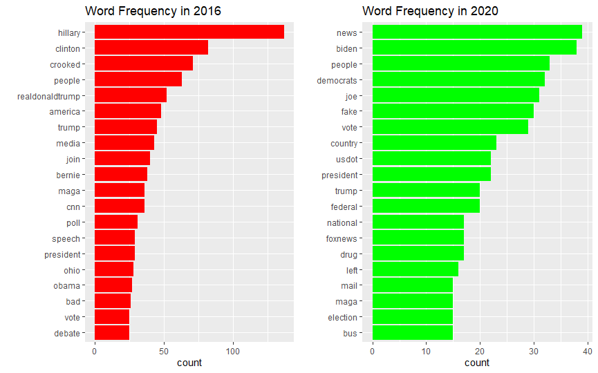

Then is the Wordcloud
I used wordcloud and wordcloud2 with names removed
The wordcloud2 has a hover effect but seems I cannot upload JS in the readme

```r
set.seed(1234)

Corpus16_1 <- RemoveNames(Corpus16)
TermFreq16 <- CreateTermsMatrix(Corpus16_1)
DF16_cloud <- data.frame(word=names(TermFreq16), count=TermFreq16)

Corpus20_1 <- RemoveNames(Corpus20)
TermFreq20 <- CreateTermsMatrix(Corpus20_1)
DF20_cloud <- data.frame(word=names(TermFreq20), count=TermFreq20)

wordcloud(DF16_cloud$word, DF16_cloud$count, max.words = 100, scale=c(2.5,.5), random.color = TRUE, colors=brewer.pal(9,"Set1"))
```

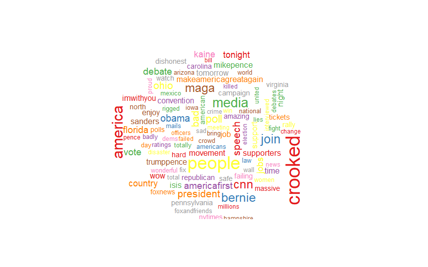

```r
wordcloud2::wordcloud2(DF16_cloud[1:100,], color = "random-light", backgroundColor = "grey", shuffle=FALSE, size=0.4)
```

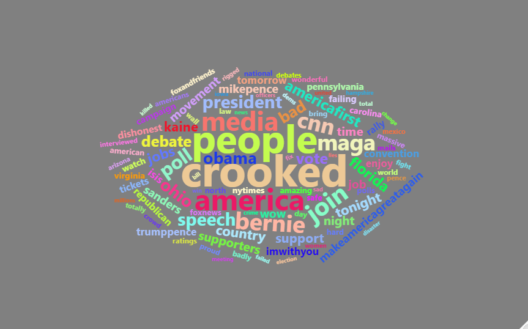

```r
wordcloud(DF20_cloud$word, DF20_cloud$count, max.words = 100, scale=c(2.5,.5), random.color = TRUE, colors=brewer.pal(9,"Set1"))
```

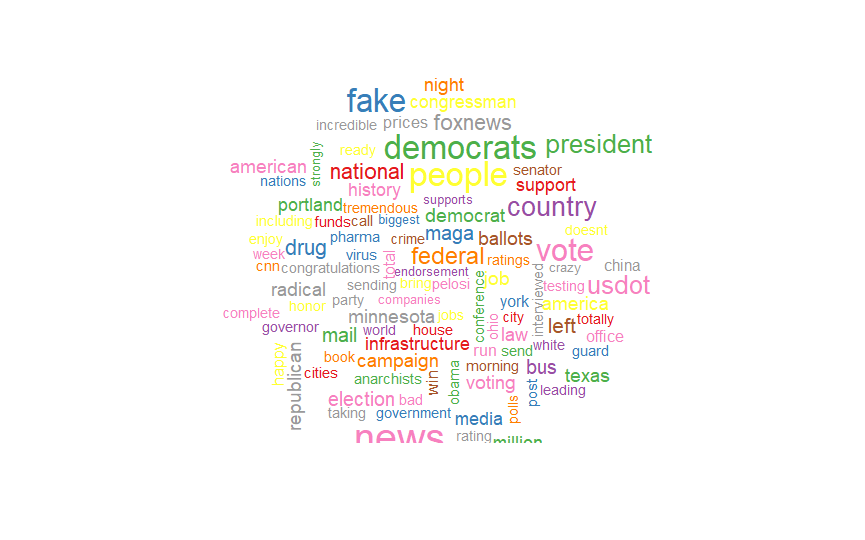

```r
wordcloud2::wordcloud2(DF20_cloud[1:100,], color = "random-light", backgroundColor = "grey", shuffle=FALSE, size=0.4)
```

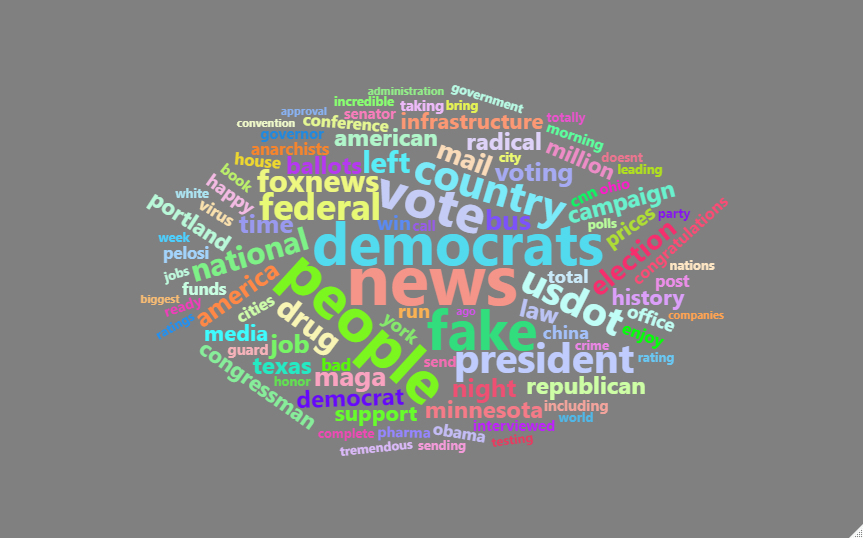

Comparison in word cloud

```r
all16 <- paste(tweets16$text, collapse = " ")
all20 <- paste(tweets20$text, collapse = " ")
all1620 <- c(all16, all20)


all1620 <- VectorSource(all1620)
allCorpus <- VCorpus(all1620)
allCorpus <- CleanCorpus(allCorpus)
allCorpus <- RemoveNames(allCorpus)

TermsAll <- TermDocumentMatrix(allCorpus)
colnames(TermsAll) <- c("16", "20")
MatrixAll <- as.matrix(TermsAll)

comparison.cloud(MatrixAll, colors = c("red", "green"), scale=c(2.3,.3), max.words = 75)
```

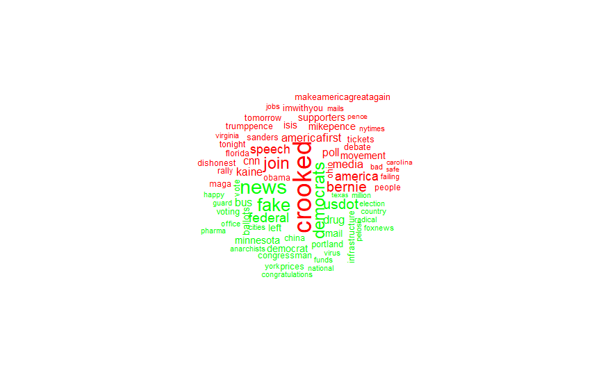

Bi-grams exploration
First we need to break the corpus to gram.

```r
Tidy16 <- tidy(Corpus16)
Tidy16_1 <- tidy(Corpus16_1)
Tidy20 <- tidy(Corpus20)
Tidy20_1 <- tidy(Corpus20_1)
```

Then plot it 
I plotted 4 with and without names in different years.

```r
plotBigrams <- function(tibble, topN=20, title="", color="FF1493"){
  x <- tibble %>% select(text) %>%
    unnest_tokens(bigram, text, token = "ngrams", n = 2)
  y <- x %>% count(bigram, sort = TRUE) %>% top_n(topN, wt=n) %>%
    ggplot(aes(x=reorder(bigram, n), y=n)) +
    geom_bar(stat='identity', fill=color) + coord_flip() +
    theme(legend.position="none") + labs(x="", title=title)
}

b1 <- plotBigrams(Tidy16, title="With names 2016", color="red")
b2 <- plotBigrams(Tidy16_1, title="Without names 2016", color="red")


b3 <- plotBigrams(Tidy20, title="With names 2020", color="green")
b4 <- plotBigrams(Tidy20_1, title="Without names 2020", color="green")

grid.arrange(b1, b2, b3, b4, ncol=2)
```

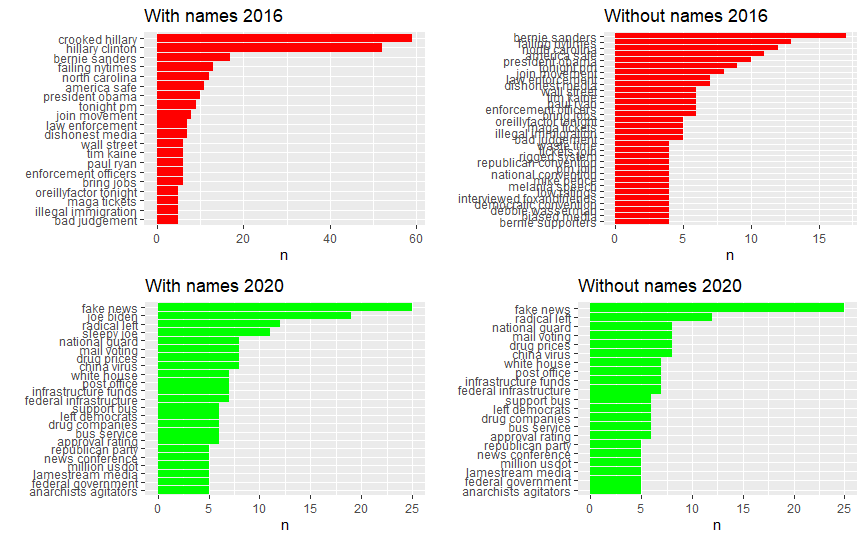

## Sentiment Analysis

First we use bing.
Bing is a corpus with words labeled positive and negative.
This will show the histogram of top positive and negative words.

```r
DocMeta16_1 <- meta(Corpus16_1)
DocMeta16_1$date <- date(DocMeta16_1$time)
Tidy16_1$date <- DocMeta16_1$date

DocMeta20_1 <- meta(Corpus20_1)
DocMeta20_1$date <- date(DocMeta20_1$time)
Tidy20_1$date <- DocMeta20_1$date

NoNamesTidy <- bind_rows(Tidy16_1, Tidy20_1)
Words <- NoNamesTidy %>% unnest_tokens(word, text)
Bing <- Words %>% inner_join(get_sentiments("bing"), by="word")

b1 <- Bing %>% count(word, sentiment, sort=TRUE) %>%
  group_by(sentiment) %>% arrange(desc(n)) %>% slice(1:20) %>%
  ggplot(aes(x=reorder(word, n), y=n)) +
  geom_col(aes(fill=sentiment), show.legend=FALSE) +
  coord_flip() +
  facet_wrap(~sentiment, scales="free_y") +
  labs(x="", y="number of times used", title="Donald Trump's most used words in 2016") +
  scale_fill_manual(values = c("positive"="green", "negative"="red"))
b2 <- Bing %>% count(word, sentiment, sort=TRUE) %>%
  group_by(sentiment) %>% arrange(desc(n)) %>% slice(1:20) %>%
  ggplot(aes(x=reorder(word, n), y=n)) +
  geom_col(aes(fill=sentiment), show.legend=FALSE) +
  coord_flip() +
  facet_wrap(~sentiment, scales="free_y") +
  labs(x="", y="number of times used", title="Donald Trump's most used words in 2020") +
  scale_fill_manual(values = c("positive"="green", "negative"="red"))
grid.arrange(b1, b2)
```

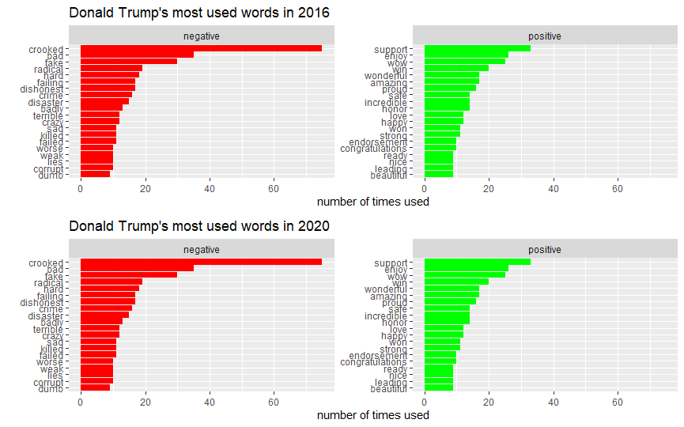

Then we plot the sentiment of the twitter in time series.
You may notice some lines are not connected and there is a obvious long line in latter half of sentiment 2020, this is because lack of data.

```r
t1 <- Bing %>% group_by(date) %>% count(sentiment) %>%
  spread(sentiment, n) %>% mutate(score=positive-negative) %>%
  ggplot(aes(x=date, y=score)) +
  scale_x_date(limits=c(as.Date("2016-07-18"), as.Date("2016-10-07")), date_breaks = "1 month", date_labels = "%b") +
  geom_line(stat="identity", col="blue") + geom_smooth(col="red") + labs(title="Sentiment 2016")

t2 <- Bing %>% group_by(date) %>% count(sentiment) %>%
  spread(sentiment, n) %>% mutate(score=positive-negative) %>%
  ggplot(aes(x=date, y=score)) +
  scale_x_date(limits=c(as.Date("2020-07-18"), as.Date("2020-10-07")), date_breaks = "1 month", date_labels = "%b") +
  geom_line(stat="identity", col="blue") + geom_smooth(col="red") + labs(title="Sentiment 2020")

grid.arrange(t1, t2, ncol=1)
```

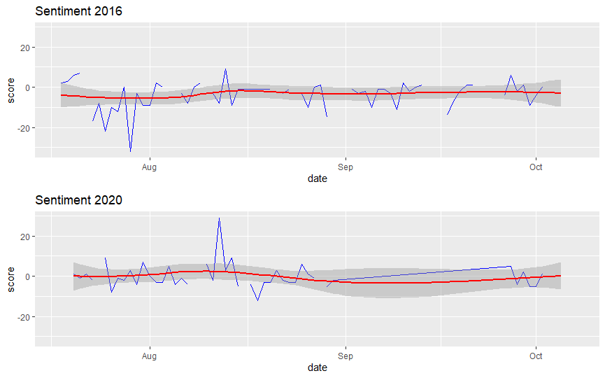

Then we use afinn.
Afinn is similar to bing but use positive and negative score.
The image has defection same to bing.

```r
Afinn <- Words %>% inner_join(get_sentiments("afinn"), by="word")

a1 <- Afinn %>%  group_by(date) %>% summarise(value=sum(value)) %>%
  ggplot(aes(x=date, y=value)) +
  scale_x_date(limits=c(as.Date("2016-07-18"), as.Date("2016-10-07")), date_breaks = "1 month", date_labels = "%b") +
  geom_line(stat="identity", col="blue") + geom_smooth(col="red") + labs(title="Sentiment 2016")
```

```r
a2 <- Afinn %>% group_by(date) %>% summarise(value=sum(value)) %>%
  ggplot(aes(x=date, y=value)) +
  scale_x_date(limits=c(as.Date("2020-07-18"), as.Date("2020-10-07")), date_breaks = "1 month", date_labels = "%b") +
  geom_line(stat="identity", col="blue") + geom_smooth(col="red") + labs(title="Sentiment 2018")

grid.arrange(a1, a2)
```

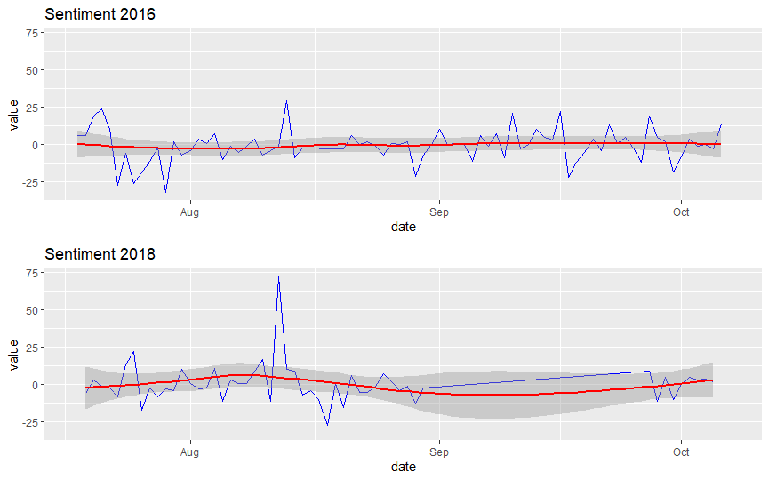

Then we use nrc.
Nrc labeled the sentiment words will different kinds of sentiment

```r
Nrc <- Words %>% inner_join(get_sentiments("nrc"), by="word")

n1 <- Nrc %>% filter(date <= "2017-02-04") %>% count(sentiment) %>%
  ggplot(aes(x=sentiment, y=n, fill=sentiment)) +
  geom_bar(stat="identity") + coord_polar() +
  theme(legend.position = "none", axis.text.x = element_blank()) +
  geom_text(aes(label=sentiment, y=500)) +
  labs(x="", y="", title="2016")
n2 <- Nrc %>% filter(date > "2017-02-04") %>% count(sentiment) %>%
  ggplot(aes(x=sentiment, y=n, fill=sentiment)) +
  geom_bar(stat="identity") + coord_polar() +
  theme(legend.position = "none", axis.text.x = element_blank()) +
  geom_text(aes(label=sentiment, y=500)) +
  labs(x="", y="", title="2020")
grid.arrange(n1, n2, nrow=1)
```
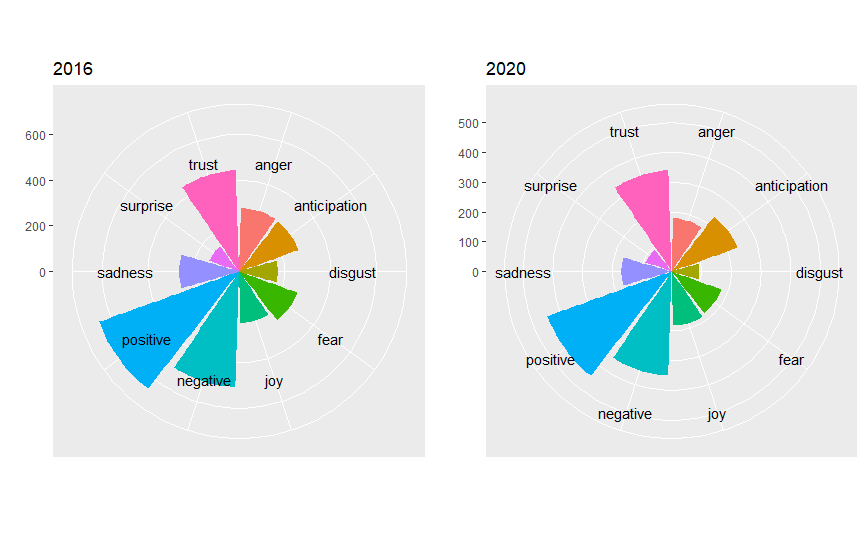


# Conclusions

In 2016 Hillary Clinton appears in Trump's tweets far more than other words. In 2020 it seems Biden didn't got enough attention as Hillary. His top focus now is fake news.

Trump's tweets most times stays neutral. In 2016 his attitude may be more positive because "crooked", which he use to describe Hillary, take accounts some of the negative sentiments.

It seems there's an important date in near August 12 which makes his attitude positive, but I cannot figure it out. I will inspect the text that day later.

Despite many hard times in 2020, it seems Trump's feeling is not greatly impacted.

# Suggestions for Further Analysis

An obvious defect is that 3 month's tweets are not enough. I cannot get the tweets because I don't know how to use Twitter's API in R. (I only use it before in Python). I think expand the data scale to 1 year may help identify more findings.